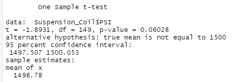
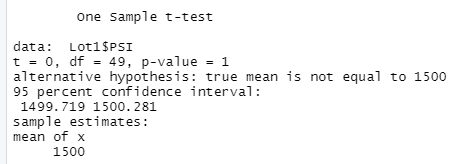
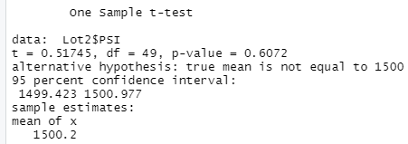
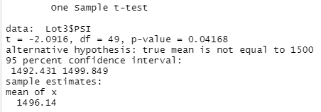

# MechaCar_Statistical_Analysis

## Linear Regression to Predict MPG
1) The variables with a non-random amount of variance to mpg values are the following:
* Intercept
* vehicle_length
* ground_clearance

2) The slope of the model is not considered zero since the coefficients wight, spoiler_angle, and AWD provide random amounts of variance to the model.

3) Since r-squared = 0.7149, we can conclude that this linear model effectively predicts mpg.

In your README, create a subheading ## Summary Statistics on Suspension Coils, and write a short summary using screenshots from your total_summary and lot_summary dataframes, and address the following question:

The design specifications for the MechaCar suspension coils dictate that the variance of the suspension coils must not exceed 100 pounds per square inch. Does the current manufacturing data meet this design specification for all manufacturing lots in total and each lot individually? Why or why not?

## Summary Statistics on Suspension Coils
Taking the variance for every vehicle, we get a total variance of 62.29 PSI which would indicate that the manufacturing data meets design specification.  
  

However, when looking at the variance of vehicles group by their lot, we can see that Lot3 has an issue that indicates the manufacturing data doesn't meet design specification.
As you can see, Lot3 has a variance of 170.29 PSI. 
  

In your README, create a subheading ## T-Tests on Suspension Coils, then briefly summarize your interpretation and findings for the t-test results. Include screenshots of the t-test to support your summary.

## T-Test on Suspension Coils
1) Using the whole Suspension_Coils database, the t-test gave a p-value of 0.060 which is above our significance level of 0.05. Therefore we can confirm the 
dataset's mean is statistically similar to the population mean of 1500. 
  

2) Using the subset of only vehicles from lot 1, the t-test gave a p-value of 1 which is well above our significance level of 0.05. Therefore we can certainly confirm the 
dataset's mean is statistically similar to the population mean of 1500. 
  

3) Using the subset of only vehicles from lot 2, the t-test gave a p-value of 0.6072 which is well above our significance level of 0.05. Therefore we can certainly confirm the 
dataset's mean is statistically similar to the population mean of 1500. 
  

4) Using the subset of only vehicles from lot 3, the t-test gave a p-value of 0.04168 which is below our significance level of 0.05. Therefore we cannot confirm the 
dataset's mean is statistically similar to the population mean of 1500. 
  

Using your knowledge of R, design a statistical study to compare performance of the MechaCar vehicles against performance of vehicles from other manufacturers.

Follow the instructions below to complete Deliverable 4.

In your README, create a subheading ## Study Design: MechaCar vs Competition.
Write a short description of a statistical study that can quantify how the MechaCar performs against the competition. In your study design, think critically about what metrics would be of interest to a consumer: for a few examples, cost, city or highway fuel efficiency, horse power, maintenance cost, or safety rating.
In your description, address the following questions:
What metric or metrics are you going to test?
What is the null hypothesis or alternative hypothesis?
What statistical test would you use to test the hypothesis? And why?
What data is needed to run the statistical test?

## Study Design: MechaCar vs Competition
1) For a statistical study there are a few metrics we can look at to determine if the MechaCar would be interesting for consumers. The first metric, as a fan of sports cars,
that I would like to look at is the MechaCar's time from 0-60 mph. If it is faster than other performance cars, consumers would definitely be interested in the MechaCar.
If it turns out that that MechaCar isn't better than other performance cars, then we would want to look at metrics for the average consumer such as mpg, cubic ft of the vehicle (storage and legroom space), and of course the cost. 

2) The null hypothesis for each individual metric would be that there is no statistical difference of the MechaCar from current production cars.
The alternative hypothesis would then be is there a statistical difference that benefits the MechaCar for the individual metric.

3) Linear regression would be used for the 0-60 time of the MechaCar to see if there is a faster time than competition.
Multi linear regression would be used for the mpg metric since we can use many variables and determine which affect mpg the most and then determine if changes in those variables are possible in production to create a better mpg metric for the MechaCar.
For the cubic ft of the vehicle, I would use a chi-squared test to determine if the catergories of vehicles the MechaCar would compete against have more or less cubic ft than the MechaCar.
For the cost, I would again use multi linear regression to use many variables and again see if anything in production can be changed to make the cost of the MechaCar cheaper than competition.

4) The data needed for testing would be the 0-60 times for the MechaCar and competitor vehicles. For mpg, you would need engine size, cylinders, mpg for city and highway, and transmission type. More variables can be added if these don't appear to have much difference. For the cubic ft you would simply need the passenger space and the cargo space for the MechaCar and competitor models. For cost, I would use all the highest cost of production data such as engineering, manufacturing, cost of parts, etc..
