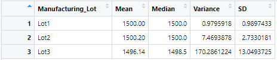

# MechaCar_Statistical_Analysis

## Linear Regression to Predict MPG
1) The variables with a non-random amount of variance to mpg values are the following:
* Intercept
* vehicle_length
* ground_clearance

2) The slope of the model is not considered zero since the coefficients wight, spoiler_angle, and AWD provide random amounts of variance to the model.

3) Since r-squared = 0.7149, we can conclude that this linear model effectively predicts mpg.

In your README, create a subheading ## Summary Statistics on Suspension Coils, and write a short summary using screenshots from your total_summary and lot_summary dataframes, and address the following question:

The design specifications for the MechaCar suspension coils dictate that the variance of the suspension coils must not exceed 100 pounds per square inch. Does the current manufacturing data meet this design specification for all manufacturing lots in total and each lot individually? Why or why not?

## Summary Statistics on Suspension Coils
Taking the variance for every vehicle, we get a total variance of 62.29 PSI which would indicate that the manufacturing data meets design specification.  
  

However, when looking at the variance of vehicles group by their lot, we can see that Lot3 has an issue that indicates the manufacturing data doesn't meet design specification.
As you can see, Lot3 has a variance of 170.29 PSI. 
  

